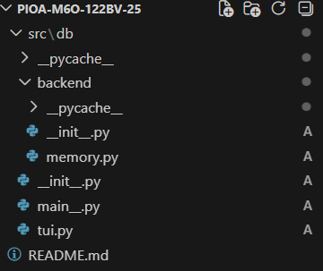

## Алямкин Илья Владимирович М6О-122БВ-25 Python

## Структура проекта

## Назначение модулей

### `backend/memory.py`
Содержит определение типа записи `StudentRecord` (кортеж из пяти полей: id, имя, фамилия, возраст, пол), саму таблицу `Student` (список записей) и функции для работы с данными:

- `create_record` — добавление новой записи с проверкой уникальности ID и корректности возраста.
- `select_record` — выборка записей с фильтрацией по любому полю (если фильтр не задан, возвращается вся таблица).
- `update_record` — обновление записи по ID. Можно изменить одно или несколько полей; если поле не передано, его старое значение сохраняется.
- `delete_record` — удаление записи по ID.

### `tui.py`
Реализует текстовый интерфейс:

- функции безопасного ввода (`_read_int`, `_read_optional_int`), защищающие от некорректного ввода (буквы вместо числа);
- функции отображения меню и результатов;
- основную функцию `run()`, запускающую цикл взаимодействия с пользователем;
- обработку исключений `ValueError`, возникающих при добавлении записи (дубликат ID, отрицательный возраст).

### `main_.py`
Импортирует функцию `run` из `tui` и запускает её при выполнении скрипта.

## Реализованная функциональность

### Добавление записи
Пользователь вводит все поля записи.

Проверка:

- ID не должен совпадать с уже существующим (иначе `ValueError`);
- возраст не может быть отрицательным (иначе `ValueError`);
- при успехе запись добавляется в таблицу и выводится на экран;
- при ошибке выводится сообщение, запись не сохраняется.

### Просмотр всех записей

- вывод всех записей из таблицы в виде кортежей;
- если таблица пуста, выводится соответствующее сообщение.

### Поиск записей по фильтрам

- пользователь может указать значения для любого поля (ID, имя, фамилия, возраст, пол);
- незаполненные поля игнорируются (интерпретируются как отсутствие фильтра);
- выводятся только записи, удовлетворяющие всем заданным условиям;
- если ни одна запись не подходит, выводится сообщение об отсутствии результатов.

### Обновление записи

- пользователь выбирает пункт 4, вводит ID записи и новые значения полей;
- если какое-то поле оставить пустым (`Enter`), старое значение этого поля сохраняется;
- при некорректных данных (например, отрицательный возраст) выводится ошибка, запись не изменяется;
- если запись с указанным ID не найдена, выводится понятное сообщение об ошибке.

### Удаление записи

- пользователь выбирает пункт 5 и вводит ID записи;
- если запись найдена, она удаляется из таблицы и выводится подтверждение;
- если запись с указанным ID отсутствует, выводится сообщение об ошибке.

### Обработка ошибок

- при вводе целых чисел программа повторяет запрос, пока не будет введено корректное число;
- исключения, возникающие в `create_record` (дубликат ID, отрицательный возраст), перехватываются в интерфейсе, и пользователю выводится понятное сообщение;
- все операции с данными защищены от некорректного ввода.

## Инструкция по запуску

### Требования

- Python версии 3.12 или выше (используется синтаксис `type StudentRecord = ...`, доступный с Python 3.12);
- операционная система: Windows, Linux, macOS.

### Шаги

1. Скопируйте все файлы проекта, сохранив указанную выше структуру папок. Убедитесь, что в папках `src/db` и `src/db/backend` присутствуют файлы `__init__.py` (они могут быть пустыми).
2. Откройте терминал и перейдите в корневую папку проекта (ту, которая содержит папку `src`):

   `cd путь/к/pioa-m60-122bv-25`

3. Запустите приложение командой:

   `python src/db/main_.py`

   Альтернативно, если вы находитесь внутри папки `src/db`, можно выполнить:

   `python main_.py`

4. Следуйте инструкциям текстового меню. Для выхода выберите пункт `0`.